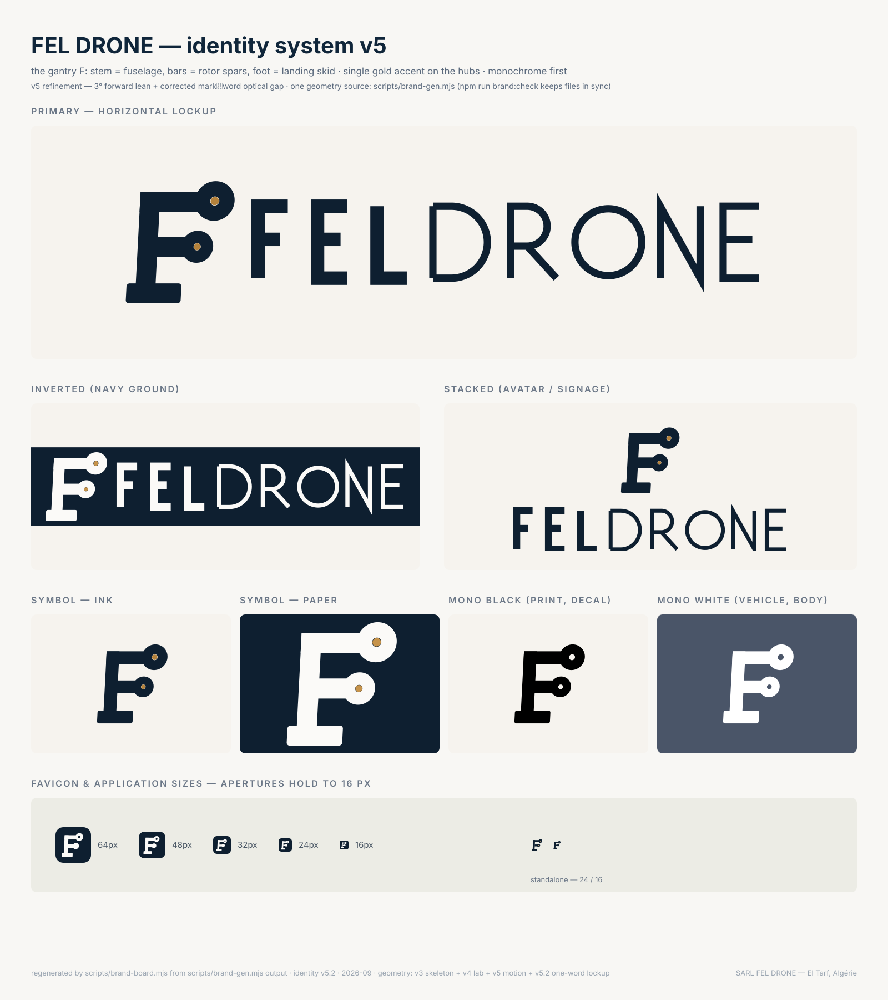

# FEL DRONE — Identity system

> Status: v5.2 — one-word lockup + optical-weight pass (2026-09). The
> wordmark is now the single word **FELDRONE** (no word space): one
> construction family, two weights — **FEL** bold (12u) / **DRONE** light
> (6.5u) — optically kerned on one ink-locked grid, and the mark's spars
> grow 24u → 26u so the symbol balances the light half of the wordmark.
> Prior v5.1 note stands: the mark gains a **3° forward
> lean** — a restrained flight cue applied to the mark group only, so the
> whole construct (discs, hubs, cut-outs) leans as one airframe at takeoff
> roll, never the wordmark. The horizontal lockup's mark→“FEL” gap is
> corrected from 28u to ≈15u, matching the wordmark's internal 16u letter
> rhythm: symbol and letters now read as ONE logo, tight but not fused.
> The favicon is an optical size of its own (bigger mass, opened rotor-1
> aperture, micro-detail dropped) so the mark wins at 16 px — see
> “Sizes & clear space”.
> Provenance (v4) holds: everything is emitted from `scripts/brand-gen.mjs`
> and `npm run brand:check` keeps the files honest. Colours, the 4u grid,
> the lean, the rotor construct and the mark's ink outline are otherwise
> unchanged from v3/v5.
>
> History: v2 “Rotor F” retired (disc read as a badge); v3 rebuilt the mark —
> the letter F **is** the airframe; v4 moved the brand lab in-repo; v5 makes
> it move.

## The mark — “Gantry F”

A twin-rotor UAV seen from above, constructed with lettering weights:

- the **stem** of the F is the fuselage spine (mast),
- the **top bar** is the forward spar, full length, ending on the axis of
  rotor 1 (the larger, forward disc),
- the **middle bar** is the sensor spar, shorter by F proportion, ending on
  the axis of rotor 2,
- the **foot** is the landing skid — it closes the letter like the serif foot
  of an engineered grotesque,
- both rotor discs are **drilled through** the spar: apertures are true
  cut-outs (mask), so the mark keeps its counters on any ground;
- a single gold hub dot marks each rotor — one accent, never on the letters.

**Engineering logic:** remove the discs and it is still a valid F; remove the
F logic and the airframe falls apart. No wings, no shield, no globe, no
aircraft outline, no drone clipped above or beside a letter.

**Flight cue (v5):** the mark group carries a uniform 3° forward lean
(`skewX(-3)` in every emitted file, including the mask content, so apertures
remain concentric). It is a trim angle, not a decoration: below ~20 px it
vanishes optically; the silhouette stays the F. The wordmark never leans.

### Geometry (design grid 4u, canvas 168 × 180)

| Element            | Geometry                                              |
| ------------------ | ----------------------------------------------------- |
| Spar weight (v5.2) | **T = 26** (mast, both bars, skid height) — 24u +8%, growth is inward    |
| Mast               | x 36→62, y 24→158 (top flush with the forward spar)   |
| Forward spar       | y 24→50, x 36→134 (ends at rotor 1 axis)              |
| Sensor spar        | y 83→109, x 60→114 (centred on the rotor-2 axis, 96)  |
| Rotor 1            | centre (134, 36), r 26; aperture r 6; hub r 5.5       |
| Rotor 2            | centre (114, 96), r 21; aperture r 4.75; hub r 4.5    |
| Skid               | x 24→96, y 144→170, rx 4 (bottom line held)           |
| Ink box            | 136 × 160 (rotor 1 breaks the top line by design)     |

Rotor 1 sits at the optical apex; rotor 2 rides the mid-axis so the F cross
is the classic 40/60 split. All coordinates sit on the 2u sub-grid (spar
half-weight 13 keeps the sensor bar exactly centred on the rotor axis);
horizontal extents and the whole ink outline are unchanged from v3/v5.

## Wordmark — “FELDRONE”

One unified word since v5.2 — no space between FEL and DRONE; the separation
lives in weight, not in air. Custom monoline geometry on a 64-unit cap grid,
butt caps, miter joins, same family of parts as the mark (bars and true
circles). **FEL 12u** (bold/semibold optical mass), **DRONE 6.5u** (light).
Weight changes by stroke only: every ink edge, the cap line, the mid bar
(29.5) and the arm lengths are shared by both halves, so the L→D junction
reads as one transition, not a font swap. Kerning: 14.5u gaps inside FEL, 14u
at the weight junction and inside DRONE (thinner ink needs slightly less air),
10u around the round O. From v5 the word starts at x 139 in the lockup canvas
— the mark→“F” ink gap (≈15u) sits on the same rhythm as the internal gaps.

## Lockups

1. **Primary horizontal** — symbol, gap, wordmark on a 632 × 128 canvas
   (v5.2: closed in from 659 as the one word is 24u shorter); the mark
   occupies x ≈23.6→123.7 after its 3° lean, the wordmark begins at 139 and
   its ink ends at ≈608.7 — left and right margins now mirror (≈23.5u).
2. **Stacked** — centred symbol above wordmark, 517 × 218 (avatars,
   signage); v5 recentres the leaning mark's ink mass over the wordmark
   axis (x 197.4).
3. **Symbol alone** — favicon, app icon, drone body, uniform, print; the
   lean rides inside the file as a group transform, never baked coordinates.
4. **Geographic secondary** (`-geo` files) — construction/grid view, for
   brand documentation and the wall plaque only; never part of primary use.

## Colour

Monochrome first; the identity must run in pure black or pure white anywhere.

| Token                             | Light surfaces | Dark surfaces |
| --------------------------------- | -------------- | ------------- |
| Ink                               | `#0e1f30`      | `#fbfaf8`     |
| Hub accent (only colour in mark)  | `#b4823c`      | `#c6934a`     |

No gradients, shadows, 3D, outlines, or tints of the mark. The gold hub is
the single brand accent and is always the hub dot — never the letters.

## Sizes & clear space

- Clear space on all sides: **one spar width (26u ≈ mark height ÷ 6.2)**,
  proportional — skid-to-whitespace rules apply as with any side bearing.
- Horizontal lockup: minimum rendered height **24 px** (print: 8 mm). The
  DRONE half is a true light weight — below 24 px, or wherever the lockup
  only fits at banner width, use the mark (favicon/symbol), not the word.
- Symbol alone: minimum **14 px**; apertures stay open at 16 px because they
  are cut-outs, not painted rings.
- On photo or coloured grounds use mono-white / mono-black; contrast ≥ 4.5:1.
- **Favicon = optical size, not a mathematical downscale (v5.1).** In the
  chip the mark fills 45u of 64u (vs 40u projected from the lockup), the
  rotor-1 aperture widens 6u → 8.5u so the cut-out survives antialiasing at
  16 px, and rotor 2 drops its 9.5u aperture (sub-pixel noise) — the small
  disc reads solid, keeping the two-rotor silhouette. The full-geometry
  lockup and standalone symbol are untouched; the favicon is the only file
  built on these constants (`FAVICON` + `FAV_HOLES` in the brand lab).

## Real-world tests passed



Website header (34 px, and the symbol degrades cleanly at 24 px mobile),
16/32 px favicon on light and dark browser chrome, navy app-icon chip,
business-card white and navy, Instagram avatar (stacked), vehicle-door
single-colour decal (symbol), drone-body plate (symbol, white), building
signage band (horizontal, inverted). Black-ink 16 px print test on newsprint
simulated: skid joins but F and both apertures hold.

## File manifest

```
scripts/brand-gen.mjs                         the brand lab: single geometry source
src/brand/brandmark.ts                          GENERATED data table (consumed by Logo.tsx)
public/favicon.svg                            navy chip 64u — optical small-size build
public/brand/fel-drone-symbol.svg             ink (+ gold hubs)
public/brand/fel-drone-symbol-inverted.svg    paper (+ gold hubs)
public/brand/fel-drone-symbol-mono-black.svg
public/brand/fel-drone-symbol-mono-white.svg
public/brand/fel-drone-horizontal*.svg        4 variants (ink/inverted/mono black/white)
public/brand/fel-drone-stacked*.svg           4 variants
public/brand/fel-drone-wordmark(-white).svg   letters only — FELDRONE, two weights
public/brand/fel-drone-horizontal-geo.svg     construction/grid sheet
```

The root `favicon.svg` and `index.html` at repo root are **generated** build
artifacts for Pages (`npm run build && npm run pages:sync`) — never edit by
hand; edit `template.html` and `public/favicon.svg` (itself emitted by the
brand lab).

## Updating

`src/components/Logo.tsx`, the favicon and every brand file come from one
geometry source: the table at the top of `scripts/brand-gen.mjs` (the v4
brand lab, replacing the out-of-band `gen_final.js` of v2/v3). To amend the
mark: change the unit geometry once, run `npm run brand:gen`, and every SVG,
the favicon and the component's data table are re-emitted together — nothing
else changes. `npm run brand:check` verifies no file drifted from the table.
Components never hard-code path data by hand.

## Prohibitions

- Do not redraw, re-proportion, rotate or mirror the mark.
- Do not add wings, globes, circuit traces, shields or aircraft.
- Do not colour the letters; do not place ink over low-contrast imagery
  without a plate.
- Do not use the geographic lockup as primary.
- Do not render the lockup below minimum sizes; drop to the symbol alone.

## Changelog

- **v5.2 (2026-09) — one-word lockup + mark optical weight.** “FEL DRONE”
  becomes **FELDRONE**: one continuous word, weight contrast instead of a
  word space (FEL 12u / DRONE 6.5u, kerned L→D at 14u), and the mark's
  spars go 24u → 26u (+8%) to balance the light half. Concept, lean,
  proportions, rotor construct, apertures and hubs are untouched; the
  favicon needs no re-tune (its optical build already sizes to the mark's
  ink box, which did not move). Wordmark SVG viewBox now frames the full
  ink box (the v5.0 file cropped bar overshoot). QC: 16–512 px contact
  sheet, light/dark + pure mono, stroke-width probes at 512 px (bold 49 /
  light 27), favicon re-checked at 16/24/32.
- **v5.1 (2026-09) — favicon optical size.** Dedicated small-size
  construction for the chip favicon (bigger mark mass, widened rotor-1
  aperture, micro-detail removed); A/B render QA at 16/24/32/48/64 px on
  light and dark before and after. Lockups, stacked and symbol files are
  byte-identical to v5.0 — this is an optical scaling pass, not a
  geometry change.
- **v5.0 (2026-09) — refinement pass.** 3° forward lean on the mark group
  (wordmark never leans) — a subtle flight cue that vanishes below ~20 px;
  horizontal lockup spacing corrected (mark→“F” gap 28u → ≈15u, matched to
  the wordmark's internal 16u rhythm); stacked mark re-centred (197.4);
  favicon re-centred in the chip (11.27); construction sheet shows the
  leaning spar axes inside the construction group. Monochrome reproduction,
  cut-out apertures and 16 px recognition re-tested after the change.
- **v4.0 (2026-09) — provenance pass.** Brand lab moved in-repo
  (`scripts/brand-gen.mjs`); all brand SVGs, the favicon and the component
  data table (`src/brand/brandmark.ts`) re-emitted from one geometry source;
  deterministic mask ids (`hm*/sm*/fm*/fv`) replace per-run random ids;
  `Logo.tsx` renders the emitted table instead of duplicated path data.
  Geometry, colours, wordmark and lockup metrics: unchanged from v3.0.
  Same pass ships the mobile-nav fix (sheet portalled to `<body>`, escaping
  the header's `backdrop-filter` containing block) and full leadership roles
  (Yassine / Menouar / Amine) in `src/data/content.ts`.
- **v3.0 (2026-09) — “Gantry F”.** Mark rebuilt from scratch; rotor discs
  become structure drilled through the spars; wordmark kept from v2.
- **v2.0 — “Rotor F”.** First engineered mark + custom monoline wordmark;
  legacy logo retired.
